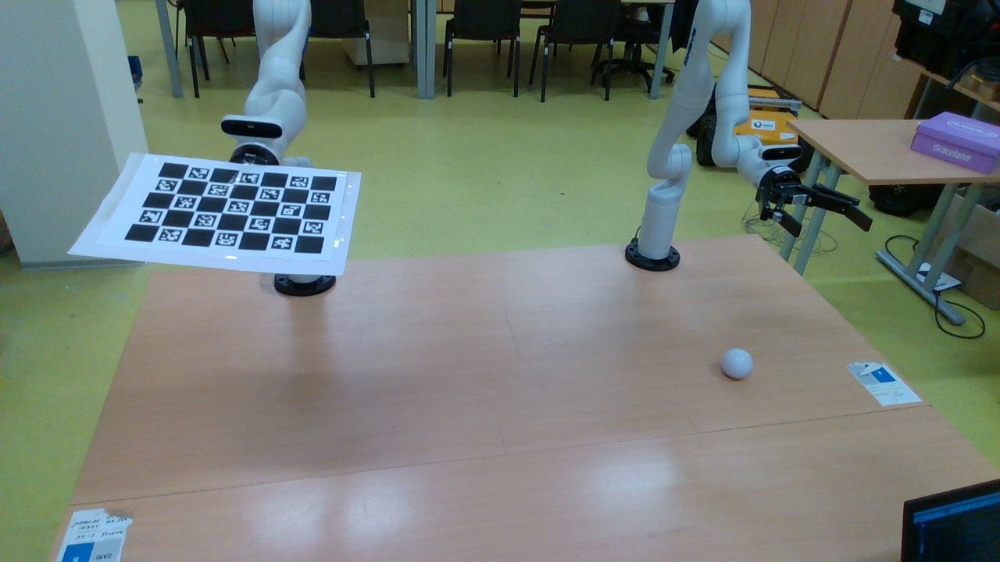
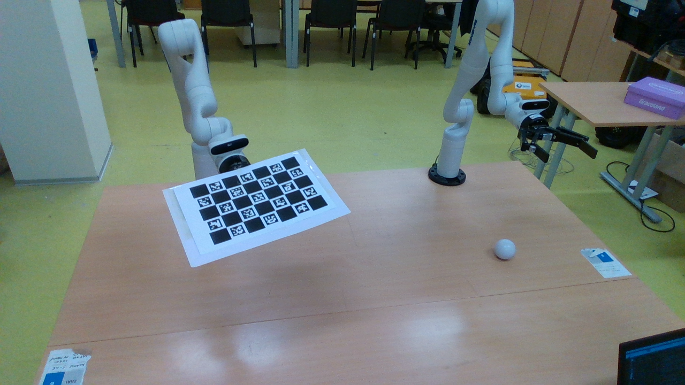

# Hand-Eye (Extrinsic) Calibration

This document describes the two-stage pipeline in `scripts/calibration/` that produces `T_BASE_CAMERA` — the transform from camera frame to robot base frame used in `camera_config.py`.

---

## When to run this

Run the calibration pipeline whenever:
- You change the mounting position or orientation of the RealSense camera.
- You move the robot to a new location on the table.
- You want to adapt the pipeline to a different robot or camera.

You do **not** need to recalibrate for normal data collection once `T_BASE_CAMERA` is set.

---

## Hardware Setup

1. Print the ChArUco board: `DICT_6X6_250`, 7×5 squares, with `SQUARE_LENGTH = 35.8 mm` and `MARKER_LENGTH = 25.8 mm`. Measure these values with calipers on your actual printout and update them in both scripts if they differ.
2. Attach the board **rigidly** to the Kinova end effector, facing the external RealSense camera.
3. Move the arm to an initial reference pose where the board is fully visible in the camera frame. This pose becomes the exploration origin.

Sample calibration frames showing the arm holding the board at different orientations:

| Frame | Notes |
|---|---|
|  | Tilted pose — large orientation offset |
|  | More frontal pose — smaller offset |

---

## Stage 1 — Data Collection

```bash
python scripts/calibration/collect_calibration_data.py \
  --save_dir calibration/extrinsic_data \
  --n_poses 30
```

The robot will:
1. Sample a random Cartesian offset from the reference pose.
2. Move to the offset pose and verify it was reached within tolerance.
3. Capture a frame and check that at least 15 ChArUco corners are detected.
4. If both checks pass, save the image and robot EE pose to disk.
5. Repeat until `--n_poses` valid pairs are collected.
6. Return to the initial reference pose.

**The script is resumable.** If interrupted, rerunning it will continue from where it left off.

### Output

```
calibration/extrinsic_data/
  extrinsic_0000.png
  extrinsic_0001.png
  ...
  robot_poses.json     ← {filename: {x, y, z, theta_x, theta_y, theta_z}}
```

### Key options

| Flag | Default | Description |
|---|---|---|
| `--save_dir` | `calibration/extrinsic_data` | Where to write images and poses |
| `--n_poses` | `30` | Number of valid pairs to collect |
| `--pos_tol` | `0.005` | Waypoint position tolerance (m) |
| `--ori_tol` | `1.0` | Waypoint orientation tolerance (deg) |
| `--dx_min/max` | `0.00 / 0.25` | Forward (X) offset range (m) |
| `--dy_range` | `0.15` | Lateral (Y) range ±value (m) |
| `--drot_xy_range` | `10.0` | Pitch/yaw range ±value (deg) |

---

## Stage 2 — Calibration Solve

```bash
python scripts/calibration/run_calibration.py \
  --data_dir calibration/extrinsic_data
```

### Algorithm

For each image:
1. **SQPnP** — globally optimal PnP for planar scenes.
2. **LM refinement** (`solvePnPRefineLM`) — sub-pixel accuracy.

For the full dataset:
3. **Daniilidis dual-quaternion** (`calibrateHandEye`) — algebraic initialisation.
4. **Outlier filtering** — drop frames whose `T_target_to_gripper` deviates by more than `--outlier_thresh` mm from the median.
5. **Non-linear SE(3) refinement** (`scipy.optimize.least_squares`) — minimise the variance of `T_target_to_gripper` across all retained frames.

The objective is that `T_target_to_gripper` — the board's pose relative to the gripper — is physically constant.  Minimising its spread across observations directly measures calibration quality.

### Output

```
============================================================
HAND-EYE CALIBRATION COMPLETE
============================================================
T_BASE_CAMERA  (T_cam_to_base):
------------------------------------------------------------
[[ 0.21883  0.54539 -0.80911  1.71418]
 [ 0.97494 -0.08806  0.20432  0.07002]
 [ 0.04018 -0.83354 -0.55099  1.04878]
 [ 0.       0.       0.       1.     ]]

============================================================
STATISTICS
------------------------------------------------------------
Euler sequence  : XYZ
Inlier frames   : 28
Mean drift      : 1.847 mm
Std dev         : 0.923 mm
Max error       : 4.102 mm
```

### Update `camera_config.py`

Copy the printed matrix into `scripts/collection/camera_config.py`:

```python
T_BASE_CAMERA = np.array(
    [[ 0.21883,  0.54539, -0.80911,  1.71418],
     [ 0.97494, -0.08806,  0.20432,  0.07002],
     [ 0.04018, -0.83354, -0.55099,  1.04878],
     [ 0.00000,  0.00000,  0.00000,  1.00000]],
    dtype=np.float64,
)
```

---

## Quality Check

A good calibration typically shows:

- **Mean drift < 5 mm** — indicates reliable world-coordinate projection.
- **Inlier count > 20** (from 30 collected) — high outlier rejection rate suggests poor data; collect more varied poses.
- **Max error < 10 mm** — large outliers may indicate a loose board mounting or inconsistent EE feedback.

After updating `camera_config.py`, run the live diagnostic to visually verify the projected world coordinates match the physical bottle position:

```bash
python scripts/collection/detect_bottle_live.py
```

---

## Dependencies

```
pip install scipy opencv-contrib-python pyrealsense2
```

The Kinova Kortex Python API is also required for `collect_calibration_data.py`.
